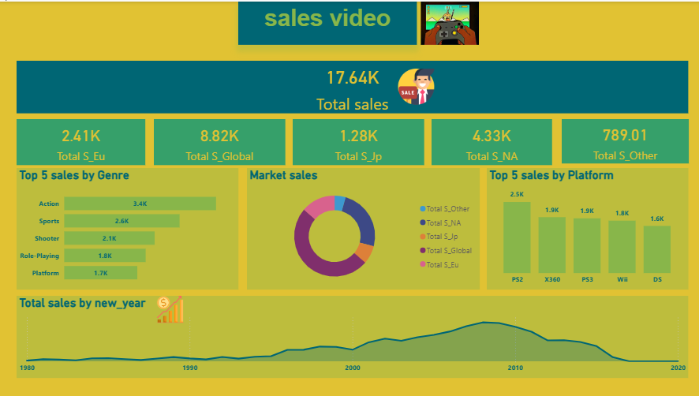
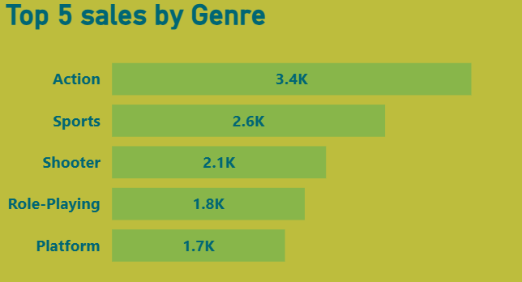
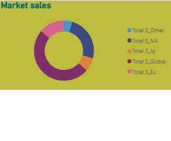
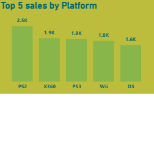
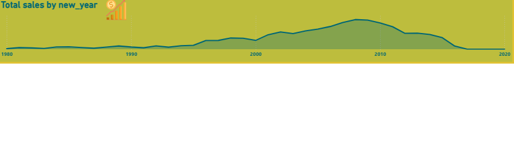

# video_sales_data_analysis
data analysis project using powerbi to explore video sales 
## Data source :
from kaggel 
## Tools used :
PowerBi
## Project Question : 
What factors influence video game sales across different region,platformand geners ??
## Explore data :
the data contains 16600 rows and 11 columns 
## Clean data :
1- unimportant columns were removed from the analysis 

2- removed errors 

3- removed duplicate data 

4- each column was converted to a number , data or text format depending on the column and its contents

5- prepared the dataset for analysis 
## data analysis :

                                                         Dashboard

                                                         

the top five best-selling video game geners are action , sports , shooter , role_playing , and platform

EU sales market account for the largest share , then NA and JP market 

the best-selling platform is ps2 , but not by a large margin compared to other platforms

as shown , the highest video game sales occurred between 2005 and 2010
## key insights :
1- are action , sports , shooter , role_playing and platform the only popular genres , or are lower sales of other genres due to weak marketing or other factors??

2- the japanese market is about half the size of the european market , is this duo to lower distribution or is it normal??

3- is the older ps2 platform better than the newer ps3 or are there issues with ps3 for users??

4- did the video game boom decline after 2015 duo to the emergence of newer technologies , or for other reasons??

